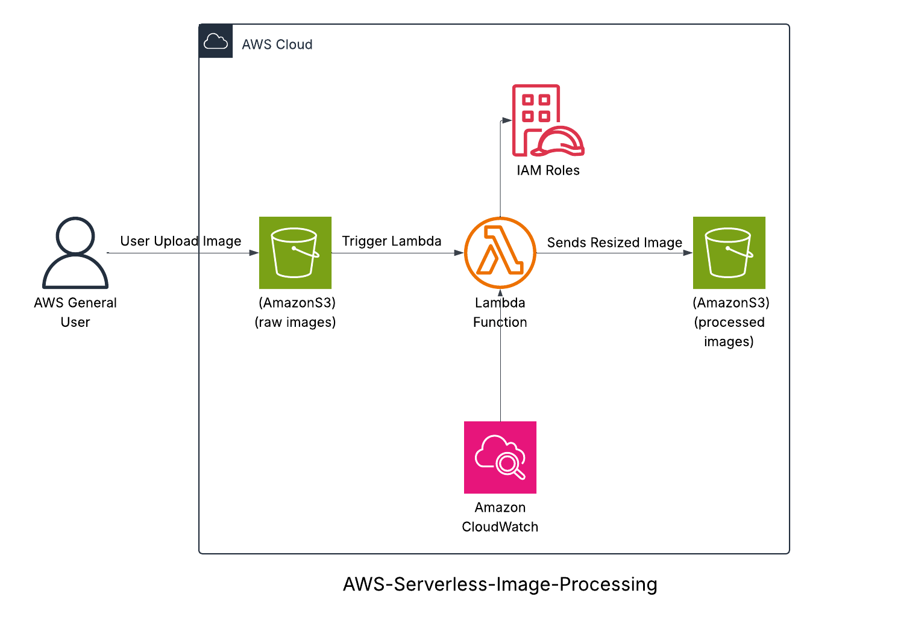

# 🖼️ Serverless Image Processing on AWS

This project demonstrates a **serverless image processing pipeline** using AWS Lambda and Amazon S3. When a user uploads an image to a source S3 bucket, the image is automatically resized and stored in a separate processed bucket.

---

## 📌 Project Overview

- **Architecture:** Serverless  
- **Goal:** Automatically resize images on upload  
- **Language:** Node.js (with Jimp library)

---

## 🧰 AWS Services Used

- **Amazon S3:** Stores original and processed images  
- **AWS Lambda:** Resizes images  
- **CloudWatch Logs:** Logs Lambda execution  
- **IAM:** Role-based access control for secure permissions


---

## 🛠️ How It Works

1. A user uploads an image to the **source S3 bucket**: `farah-raw-images`
2. This triggers a **Lambda function** via an S3 event
3. Lambda uses the **Jimp** library to resize the image to `300×300` pixels
4. The resized image is uploaded to the **destination bucket**: `farah-processed-images`
5. Execution logs are saved in **CloudWatch Logs**

---

## 🖼️ Architecture Diagram



---

## 📁 Project Structure

```
aws-serverless-image-processing/
├── lambda/
│   ├── index.js              # Main Lambda function
│   ├── package.json          # Project dependencies (Jimp)
│   └── package-lock.json     # Dependency lock file
├── architecture-diagram.png  # Solution architecture
├── demo.mp4                  # Demo video (optional)
└── README.md                 # Project documentation
```

---

## ▶️ Demo

A video demonstration of the project is available at the link below:  
📹 [Watch Demo Video](https://drive.google.com/file/d/14Yv-locjHRiY64Y13JOQLZrfRwMlI0o9/view?usp=sharing)

---

## 🔐 IAM Role Required for Lambda

The Lambda function must be assigned an IAM role with the following permissions:

```json
{
  "Effect": "Allow",
  "Action": ["s3:GetObject", "s3:PutObject"],
  "Resource": [
    "arn:aws:s3:::farah-raw-images/*",
    "arn:aws:s3:::farah-processed-images/*"
  ]
}
```

And for CloudWatch logging:

```json
{
  "Effect": "Allow",
  "Action": [
    "logs:CreateLogGroup",
    "logs:CreateLogStream",
    "logs:PutLogEvents"
  ],
  "Resource": "*"
}
```

---

## ✅ Learning Outcomes

- Build serverless event-driven applications on AWS  
- Automate workflows with S3 triggers and Lambda  
- Use IAM for secure access control  
- Perform image manipulation using Node.js and Jimp  
- Understand the fundamentals of AWS architecture and monitoring

---

## 👤 Author

**Farah Nabil Abdo Hareb**  
📧 farahnabil921@gmail.com  
📍 Alexandria, Egypt  
🔗 [LinkedIn Profile](https://linkedin.com/in/farah-nabil-42b1962b5)

---
